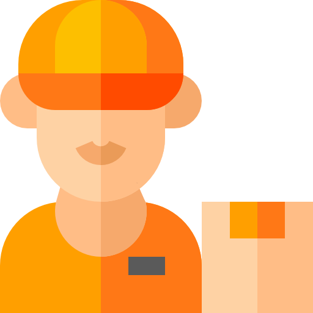
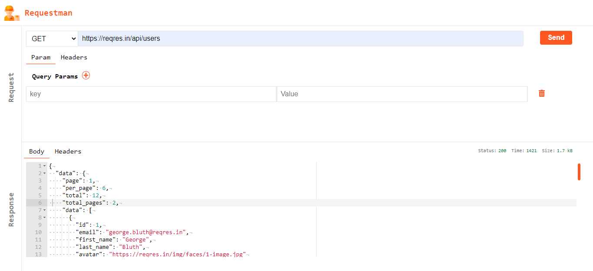

<!-- Title -->

<p align="center">
  <a href="https://github.com/arunahuja94/requestman">
    
    <h1 align="center">REQUESTMAN</h1>
  </a>
</p>

<!-- Header -->

<p align="center">
  <b>Requestman is an API client that makes it easy for developers to create, share, test and document APIs.</b>
  <br />

  <p align="center">
    <!-- Web -->
    
  </p>
  
</p>


<!-- Body -->

```sh
git clone https://github.com/arunahuja94/requestman.git
```

Once you're up and running with Requestman

<p align="center">
  
</p>

# Requestman (https://arunahuja94.github.io/requestman/)

A postman clone in react ( in progress... )

# Post Req test 

URL - https://reqres.in/api/login

body -> email : eve.holt@reqres.in ; password : cityslicka

# get req test

URL - https://reqres.in/api/users
